[OpenGL 3D 2019 第01回]

# バージョン管理すべし。例外はない。

</br>

## 1 Git(ぎっと)について

### 1.1 Git とは
Git（ぎっと）は、プログラムのソースコードなどの変更履歴を記録・追跡するための分散型
バージョン管理システムです。「バージョン管理システム」は、ファイルの変更履歴を管理す
るためのプログラムです。

バージョン管理システム(VCS)とは、一つのファイルやファイルの集合に対して、時間ととも
に加えられていく変更を記録し、後で特定バージョンを呼び出すことができるようにするため
のものです。

かつてLinuxカーネルのソースコード管理にはBitKeeperという商用ソフトウェアが用いられてい
ました。しかし、BitKeeperの開発元であるBitMover社は、 2005 年 4 月に無償提供をやめてしまい
ました。そこで、リーナス・トーバルズらによって、Linuxのための新たなバージョン管理シス
テムとして開発されたのがGitです。

Gitは次のような仕組みになっています。

### 1.2 ローカル・リポジトリとリモート・リポジトリ

リポジトリとは倉庫や金庫といった意味で、ファイルやディレクトリの状態を保存する場所で
す。変更履歴を管理したいファイルをリポジトリの管理下に置くことで、その変更履歴を記録
することができます。

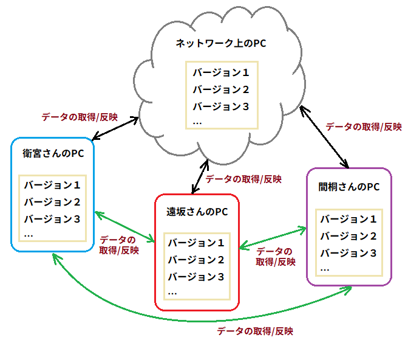

リポジトリは自分のPC内にある「ローカル・リポジトリ」とサーバなどネットワーク上にある
「リモート・リポジトリ」の 2 箇所にあります。基本的にローカル・リポジトリで作業を行い、プッ
シュという操作によって、その作業内容をリモート・ポジトリへ送り込みます。
上の図では、衛宮さん、遠坂さん、間桐さんのPCにあるのがローカル・リポジトリで、ネット
ワーク上のPCにあるのがリモート・リポジトリにあたります。

### 1.3 コミット **(commit)** とプッシュ **(push)**

コミットは、ファイルの追加や変更の履歴をリポジトリに保存することです。
プッシュは、ファイルの追加や変更の履歴をリモートリポジトリにアップロードすることで
す。

### 1.4 ブランチ（ **branch** ）

ソフトウェアの開発では、現在リリースしてるバージョンのメンテナンスをしながら新たな機
能追加やバグ修正を行わなければならない場合があります。ブランチ(「木の枝」という意味)
は、このような並行して行われる複数のバージョンを管理するための機能です。
ブランチは履歴の流れを分岐して記録していくものです。分岐したブランチは他のブランチの
影響を受けないため、同じリポジトリ内でそれぞれの開発を行っていくことができます。

## 2 Visual Studio から Git を使う

### 2.1 GitHub Extension for Visual Studio のインストール

GitHub Extension for Visual Studio(ぎっとはぶ・えくすてんしょん・ふぉー・びじゅある・すたじお)は、
Visual StudioからGitHubにアクセスするためのツールです。
まず、ツールメニューより「拡張機能と更新プログラム」を選択してください。
右ペインから「オンライン->Visual Studioギャラリー」を選択し、検索ボックスに「git」と入力
すると「GitHub Extension for Visual Studio」が見つかるはずです。ダウンロードボタンを押して
ダウンロードしてください。その後インストールが始まりますので、インストーラーの指示に
従ってインストールを完了させてください。途中で再起動を要求されることがありますが、そのときは
指示に従って再起動してください。

### 2.2 ソース管理ツールの選択

続いて、ソース管理方法をVisual Studio Tools for Gitに変更します。
ツールメニューのオプションから「ソース管理」を選択し、現在のソース管理プラグインから
「Git」を選択してください。

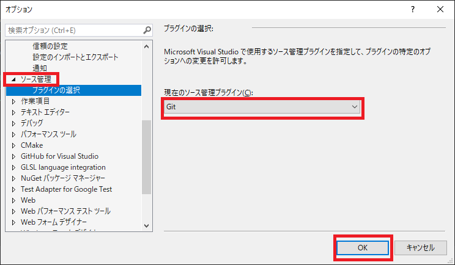

これで、Visual StudioからGitの機能を操作できるようになります。

### 2.3 Git管理プロジェクトを作成する

それでは、ソース管理付きのプロジェクトを作ってみましょう。
Visual Studio上部のメニューから「ファイル→新規作成→プロジェクト」を選択して、新しいプロジェクトを
作成するウィンドウを開いてください。


ウィンドウを開いたら、中央のリストから「Windowsコンソールアプリケーション」を選択します(1)。
続いて、名前にプロジェクト名を設定し(2)、場所を適切なドライブとフォルダを指すように変更します(3)。
Cドライブの空き容量が少ない場合、他のドライブを選択したほうが無難です。
なお、「デスクトップ」はCドライブの一部なので、空き容量を気にする場合は選ばないでください。
次に、「ソリューションのディレクトリを作成」のチェックを外します(4)。
そして、「新しいGitリポジトリの作成」にチェックを入れます(5)。
1～5を全て設定し終えたら、「OK」をクリックするとプロジェクトが作成されます(6)。

> **［補足］**
> 既存のプロジェクトをGitで管理するには、ソリューションエクスプローラーのソリューション名を
> 右クリックし「ソリューションをソース管理に追加」を選択します。

### 2.4 チームエクスプローラーの操作

次に、チームエクスプローラーを開きます。ウィンドウが開いていない場合は、メニューから
「表示→チームエクスプローラー」を選択してウィンドウを開いてください。
チームエクスプローラーの上部にいくつかアイコン画像が並んでいますが、まずは「家」の形をしたアイコンを
クリックしてください。すると、チームエクスプローラーのホーム画面が表示されます。

|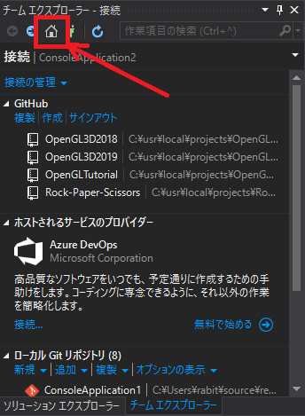|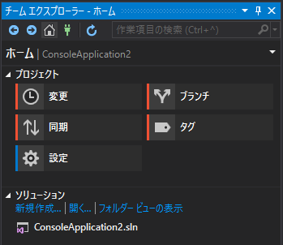|

ここでは操作の選択と、ソース管理されているソリューションのリストが見られます。


ホーム画面が表示されたら、「設定」ボタンを押し、次に「グローバル設定」をしてください。
「ユーザー名」、「電子メールアドレス」を入力して(初期値としてWindowのログオンに使用した
ものが入力済みかもしれません。その場合はそのままで構いm線)、「更新」ボタンを押してください。
これで初期設定は完了です。

また、チームエクスプローラー最上段の「ホーム」などと表示されている文字をクリックすると、
以下のようなメニューが開きます。

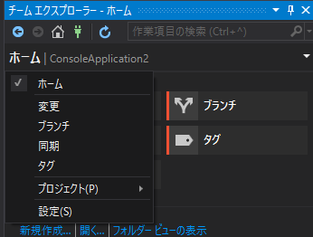

これは操作モードを変更するためのメニューです。左側にチェックがついているのが現在の操
作モードです。この方法を使うと、いちいちホーム画面に戻らなくても操作モードを切り替えることができます。

### 2.5 変更をコミットする

それでは、「変更」をクリックして、変更モードにしてください。
現在はなんの変更も加えていないので、「ステージされていない変更は作業ディレクトリに存在しません」のような
メッセージが表示されるだけです。
なにか変更を加えて、どう変化するか見てみましょう。
ソリューションエクスプローラーに切り替えて、「Src」フォルダに「Scene.h」というヘッダーファイルと「Scene.cpp」
というソースファイルを追加してください。
追加したらチームエクスプローラーに切り替えます。すると、次のように変更点が表示されます。

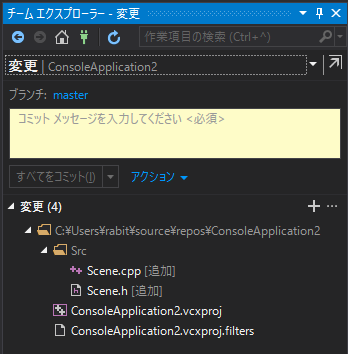

変更がある状態では、まずメッセージの入力欄があり、その下に変更のあったファイルがリストアップされます。
まずはScene.cppを操作してみましょう。ファイルを右クリックすると操作メニューが表示されますので「ステージ」を選択してください。
すると、表示が以下のように変化します。

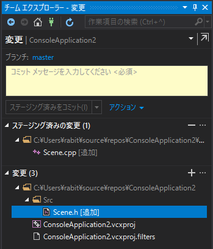

Gitでは、コードの変更をひとまとめにしてコミットすることで、複数のファイルに関連する変更を管理できるようになっています。
このコミットするファイルを選択する操作は「ステージング」と呼ばれます。
それでは「変更」にリストされている残りの3ファイルもステージングしてください。
このとき、Shiftキーを押しなががらクリックすると範囲選択ができます。また、Ctrlキーを押しながら選択すると、
複数のファイルを選択できます。
同時にコミットすべきファイルを全てステージングしたら、メッセージを書いてコミットしましょう。
コミットメッセージの入力欄に以下のメッセージを入力してください。
```
シーン管理クラス用のファイルを追加.
```
メッセージを入力すると、「ステージング済みをコミット」ボタンが押せるようになりますので、クリックしてください。
これでコミット完了です。

ソリューションエクスプローラーを開いてみてください。コミットしたファイルには、青い錠前のアイコンが表示されていると思います。
この錠前が表示されているものが「最新バージョン」のファイルです。
ファイルに変更を加えると、このアイコンが赤いチェックマークに変わり、変更されたことを教えてくれます。
変更されたファイルはチームエクスプローラーの変更モードで「変更」リストに表示され、
ファイルを右クリックして「ステージ」を選ぶとステージングできます。また、変更をなかっ
たことにしたい場合は「変更を元に戻す」を選びます。
どのような変更が行われたかを見るには「未変更のものと比較」を選びます。
ステージングしたあとは、先程と同様にメッセージを書いてコミットします。

### 2.6 コミットメッセージは分かりやすく書く

コミットメッセージには、変更内容がわかる文章を書きましょう。
今回は変更点が少なかったため、メッセージも簡単なもので十分でしたが、
あとから変更内容を追っていく時にはこのメッセージが手がかりになるので、必要に応じて詳しく書くようにします。
メッセージの書き方は自由ですが、一般的に守られている書式があるので、できるだけそれに従ってください。
といっても難しいものではありません。最初の行に変更点の要約を書き、 1行開けてその下に詳細を書くだけです。
例えば:
```
フォントサイズの計算を修正.

テクスチャ上のサイズとスクリーン上のサイズは異なるため、分けて計算しなければならない.
```
シーン用ソースを追加したときのように、詳しく書くほどでもない小さな変更の場合は1行目の要約だけで構いません。

> **［注意］** ステージング前にコミットメッセージを書くと、ボタンが「全てをコミット」に変わります。
> これは「変更」リストの内容全てをステージングしてコミットします。
> 不要なファイルまでコミットされる危険性があるため、できるだけこの機能を使わず、手動でステージングして
> からコミットするようにしてください。

## 3 Sceneクラスの作成

ここからはSceneクラスを作成しながら、Gitの使い方に慣れていきましょう。
まずはScene.hを開き、「#pragma once」と書かれた行を消します。そして、次のプログラムを追加してください.
```c++
/**
* @file Scene.h
*/
#ifndef SCENE_H_INCLUDED
#define SCENE_H_INCLUDED
#include <memory>
#include <string>

class SceneStack;

/**
* シーンの基底クラス.
*/
class Scene {
public:
  Scene(const char* name);
  Scene(const Scene&) = delete;
  Scene& operator=(const Scene&) = delete;
  virtual ~Scene();

  virtual bool Initialize() = 0 {}
  virtual void ProcessInput() = 0 {}
  virtual void Update(float) = 0 {}
  virtual void Render() = 0 {}
  virtual void Finalize() = 0 {}

  virtual void Play();
  virtual void Stop();
  virtual void Show();
  virtual void Hide();

  const std::string& Name() const;
  bool IsActive() const;
  bool IsVisible() const;

private:
  std::string name;
  bool isVisible = true;
  bool isActive = true;
};
using ScenePtr = std::shared_ptr<Scene>;

#endif // SCENE_H_INCLUDED
```

次に、Scene.cppを開き、次のプログラムを追加してください。

```c++
/**
* @file Scene.cpp
*/
#include "Scene.h"
#include <iostream>

/**
* コンストラクタ.
*
* @param name シーン名.
*/
Scene::Scene(const char* name) : name(name)
{
}

/**
* デストラクタ.
*/
Scene::~Scene()
{
  Finalize();
}

/**
* シーンを活動状態にする.
*/
void Scene::Play()
{
  isActive = true;
}

/**
* シーンを停止状態にする.
*/
void Scene::Stop()
{
  isActive = false;
}

/**
* シーンを表示する.
*/
void Scene::Show()
{
  isVisible = true;
}

/**
* シーンを非表示にする.
*/
void Scene::Hide()
{
  isVisible = false;
}

/**
* シーン名を取得する.
*
* @return シーン名.
*/
const std::string& Scene::Name() const
{
  return name;
}

/**
* シーンの活動状態を調べる.
*
* @retval true  活動している.
* @retval false 停止している.
*/
bool Scene::IsActive() const
{
  return isActive;
}

/**
* シーンの表示状態を調べる.
*
* @retval true  表示状態.
* @retval false 非表示状態.
*/
bool Scene::IsVisible() const
{
  return isVisible;
}
```
|

プログラムが書けたら、Gitにコミットしましょう。
チームエクスプローラーを開くと、変更リストにScene.cppとScene.hが表示されていると思います。
この2つを「右クリック→ステージ」して、ステージングしてください。
2つのファイルをステージングしたら、コミットメッセージ欄に以下のメッセージを書いてください。

> シーンクラスの定義を作成.

書いたら「ステージング済みをコミット」をクリックしてコミットしてください。

次は、シーンクラスにちょっとした変更を加えてみましょう。
Scene.cppを次のように変更してください。

```diff
 /**
 * コンストラクタ.
 *
 * @param name シーン名.
 */
 Scene::Scene(const char* name) : name(name)
 {
+  std::cout << "Scene コンストラクタ: " << name << "\n";
 }
 
 /**
 * デストラクタ.
 */
 Scene::~Scene()
 {
   Finalize();
+  std::cout << "Scene デストラクタ: " << name << "\n";
 }
 
 /**
 * シーンを活動状態にする.
 */
 void Scene::Play()
 {
   isActive = true;
+  std::cout << "Scene Play: " << name << "\n";
 }
 
 /**
 * シーンを停止状態にする.
 */
 void Scene::Stop()
 {
   isActive = false;
+  std::cout << "Scene Stop: " << name << "\n";
 }
 
 /**
 * シーンを表示する.
 */
 void Scene::Show()
 {
   isVisible = true;
+  std::cout << "Scene Show: " << name << "\n";
 }
 
 /**
 * シーンを非表示にする.
 */
 void Scene::Hide()
 {
   isVisible = false;
+  std::cout << "Scene Hide: " << name << "\n";
 }
```

変更したら、Scene.cppを「右クリック→ステージ」して、ステージングしてください。
そして、コミットメッセージ欄に以下のメッセージを書いてください。

> シーンの変更をコンソールに出力.
>
> デバッグのために、シーンの状態が変化したとき、その内容をコンソールに出力する.

書いたら「ステージング済みをコミット」をクリックしてコミットしてください。


## 3 GitHub

GitHubは世界最大のGitを利用したソフトウェア開発プロジェクトのためのソースコード管理
サービスです。
世界中のGitリポジトリがGitHubに置かれており、ソースコードの管理以外にも、問題の追跡や
コードレビューなどに利用されています。
公開されているソースコードの閲覧や簡単なバグ管理機能、SNSの機能を備えています。

### 3.1 アカウント登録

まずは、GitHubのトップページ(github.com)にアクセスします。
GitHub用のアカウント登録はトップページから作成できます。
まずはユーザ名とメールアドレス、パスワードを入力し、「Sign up for free」と書かれたボタンをクリックします。

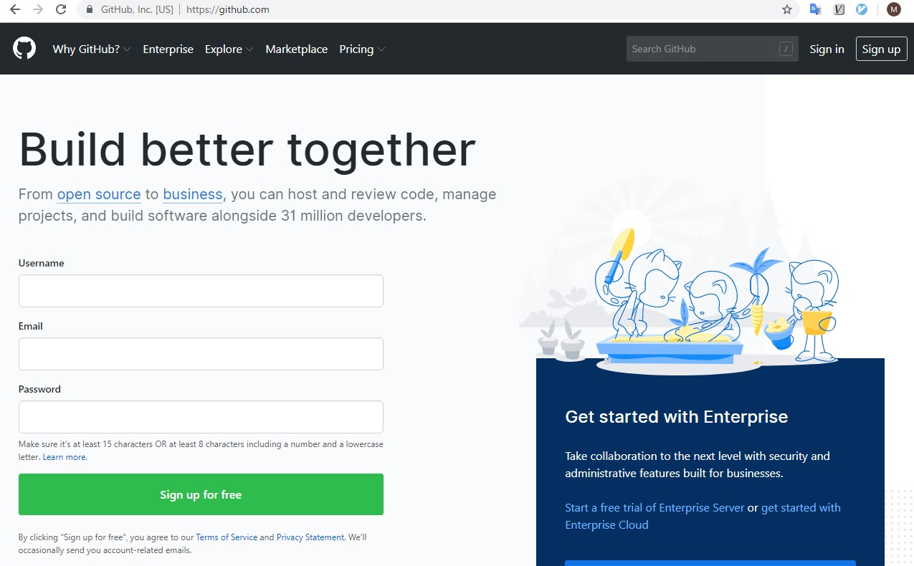

現在、登録者が自動登録プログラムなどではないことを証明するため、簡単なパズルを解くように要求されます。
「検証開始」ボタンをクリックして、数回パズルを解き、人間だと判定されると自動的に次のステップへ進みます。

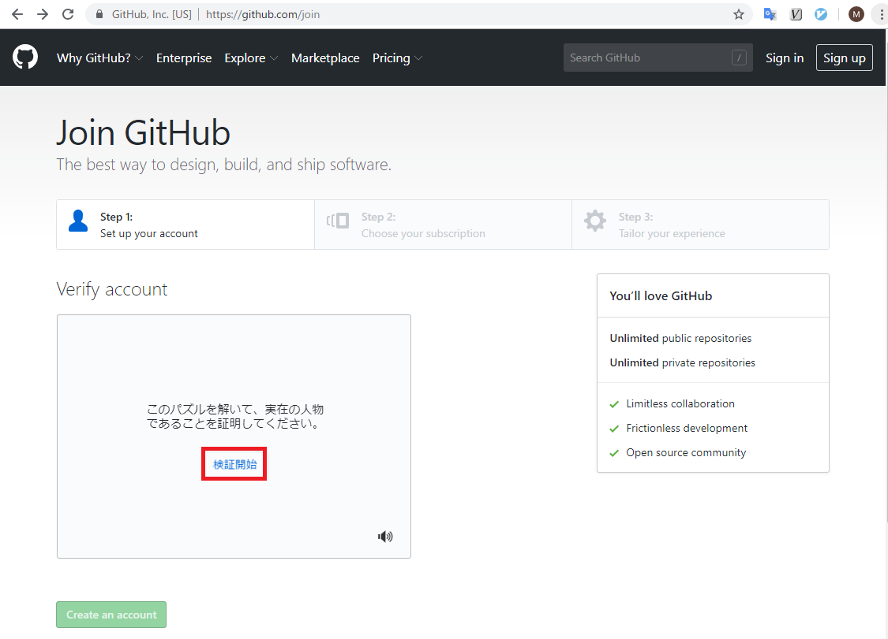

続いて、プランを選択します。2019年4月現在、無料のフリー・プランと有料のプロ・プランがあります。
プロ・プランには、たくさんの人が関わる非公開リポジトリを作成する機能がありますが、
それ以外の機能は全てフリー・プランでも利用可能です。
今回はフリー・プランで登録しましょう。「Free」をクリックしてチェックマークを付け、ページの下部にある
「Continue(こんてぃにゅー)」ボタンをクリックします。

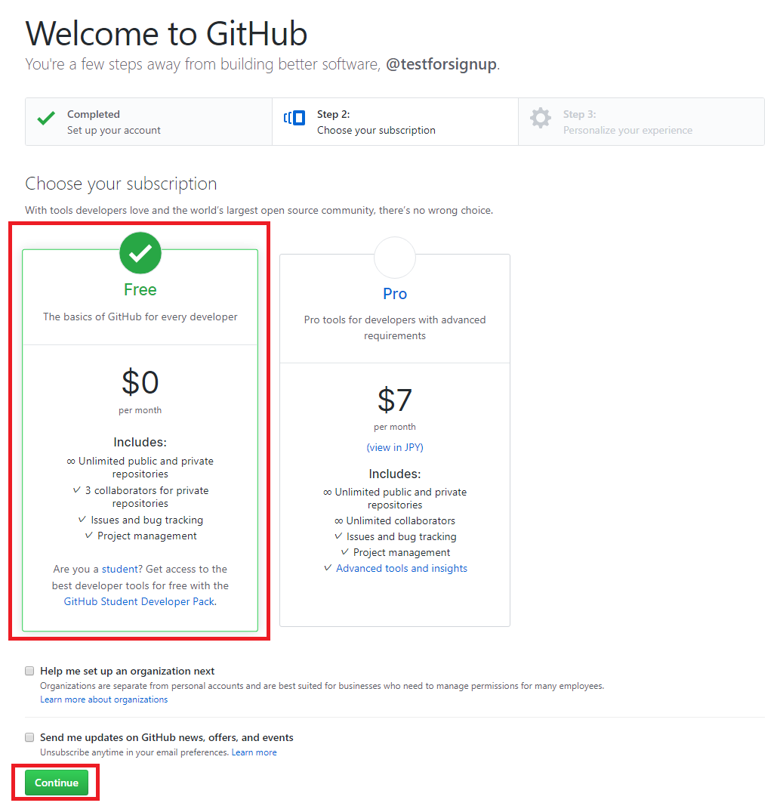

最後のステップでは、プログラミング経験(level of programming experience)と、GibHubをどのように
利用したいか(plan to use for GitHub for)、興味のある事柄(interested in)を聞かれます。
ページ下部の「skip this step」という文字をクリックすれば、このステップを飛ばせます。
とりあえず飛ばしてください(正直に答えても問題ありません)。

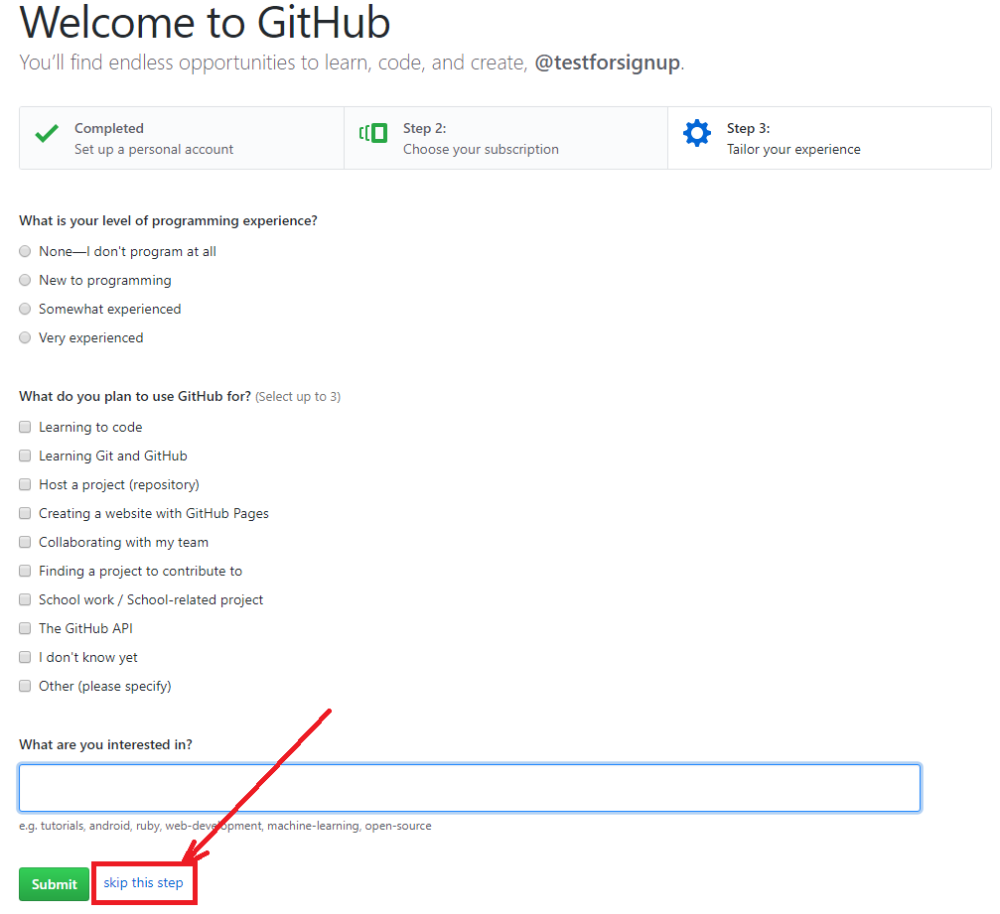

すると、以下の画面が表示されます。

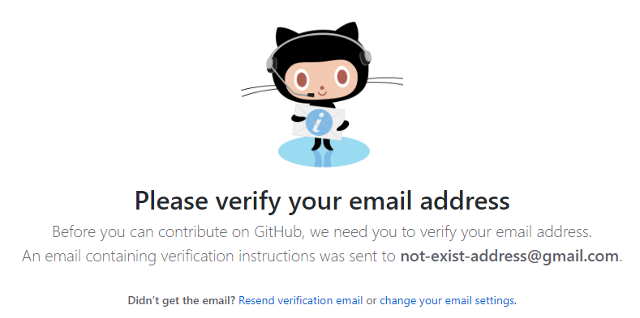

最初に登録したメールアドレスに、認証用メールが届きますので、メールの内容に従いユーザ認証を行いましょう。
メール本文に「Verify email address」と書かれたリンクがあると思うので、それをクリック(またはタップ)してください。

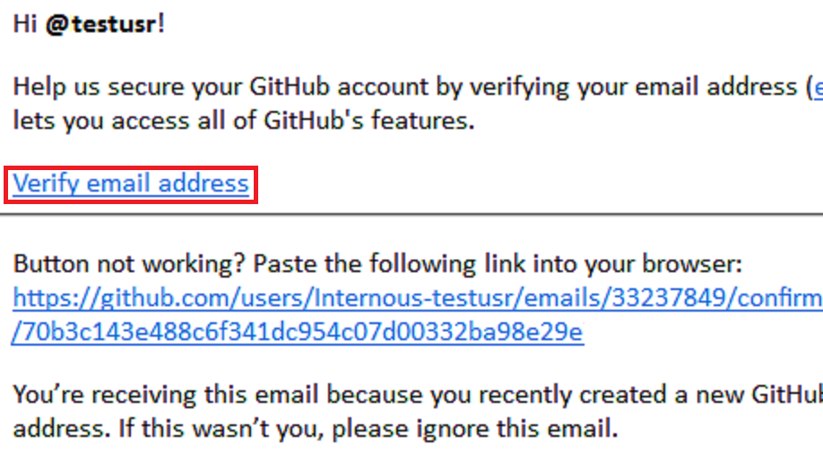

すると、GitHubの認証済みページが開きます。
これでGitHubのアカウント登録は完了です。

### 3.2 ローカルリポジトリを GitHub にプッシュする

それでは、ソリューションをGitHubにプッシュしましょう。
チームエクスプローラーを開き、「同期」ボタンを押して同期モードにしてください。
「GitHubに発行」ボタンを押すと、GitHubにサインインするダイアログボックスが開きます。
メールアドレスとパスワードを入力してサインインしてください。一度サインインすれば、
Visual Studioを開き直したときもサインインした状態になります。

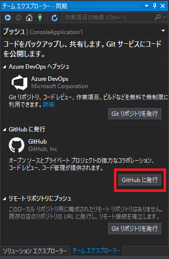

サインイン後、チームエクスプローラーに作成するリモートリポジトリ名とその説明の入力欄
が現れます。リモートリポジトリ名の初期値はソリューション名になっています。これらを埋
めて「公開」ボタンを押すと、ローカルリポジトリの内容がGitHubにプッシュされます。


ウェブ・ブラウザでGitHubリポジトリを見るには、サインインしていれば右上のアイコンを
クリックして「Your profile」を選びます。あるいは、アカウントを登録したときに表示さ
れたURLを入力します。

リモートリポジトリが追加されているでしょうか。
